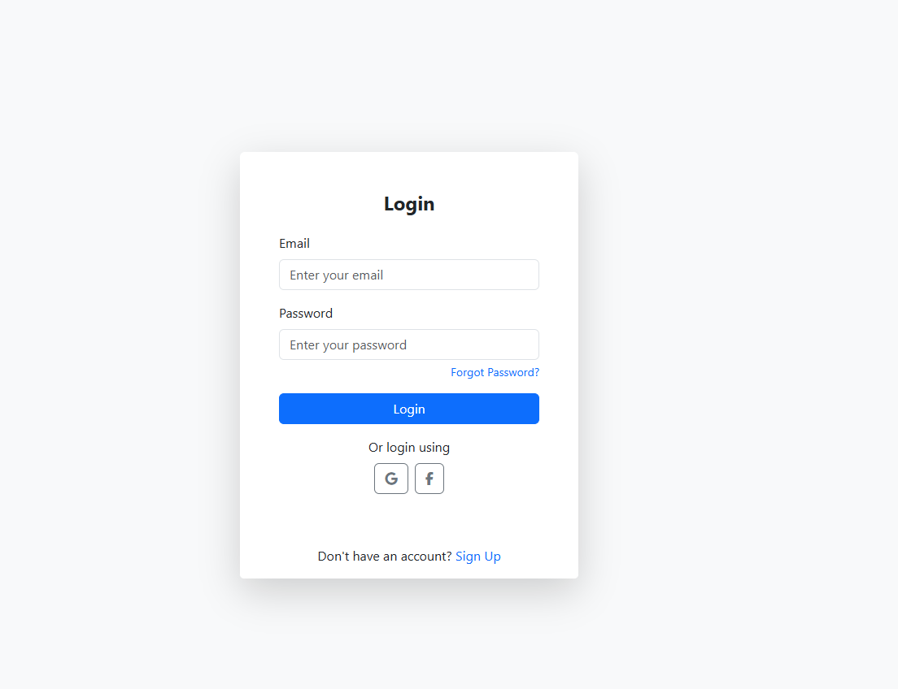
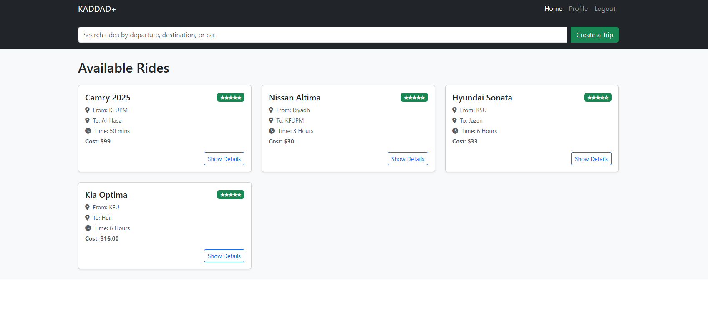
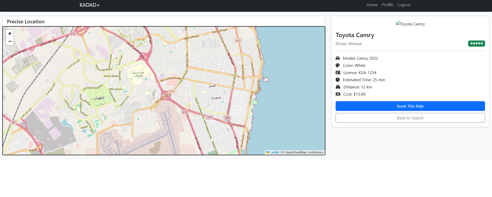
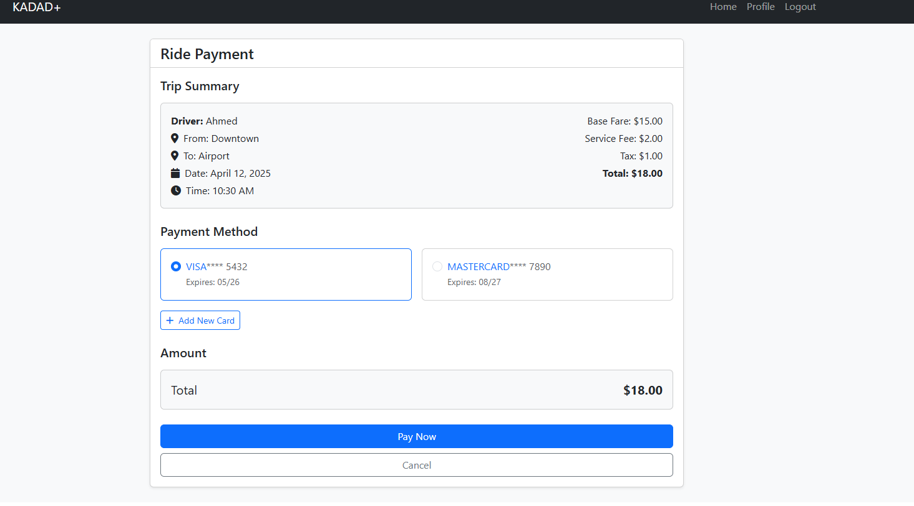
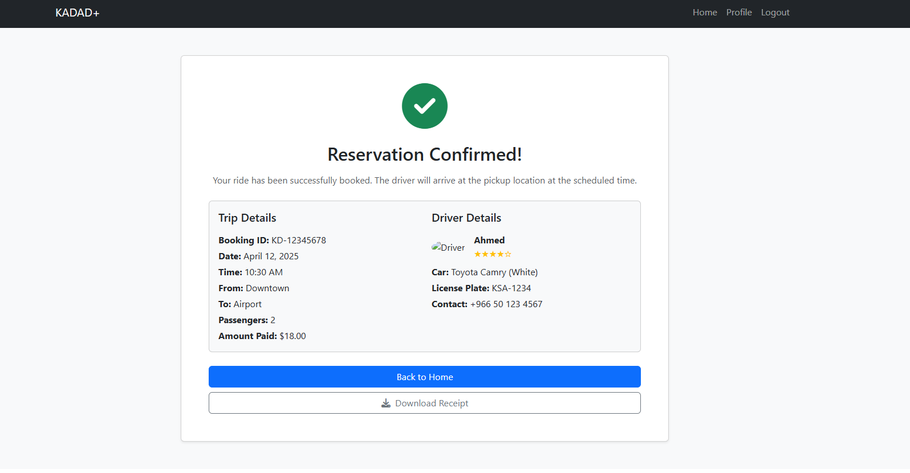
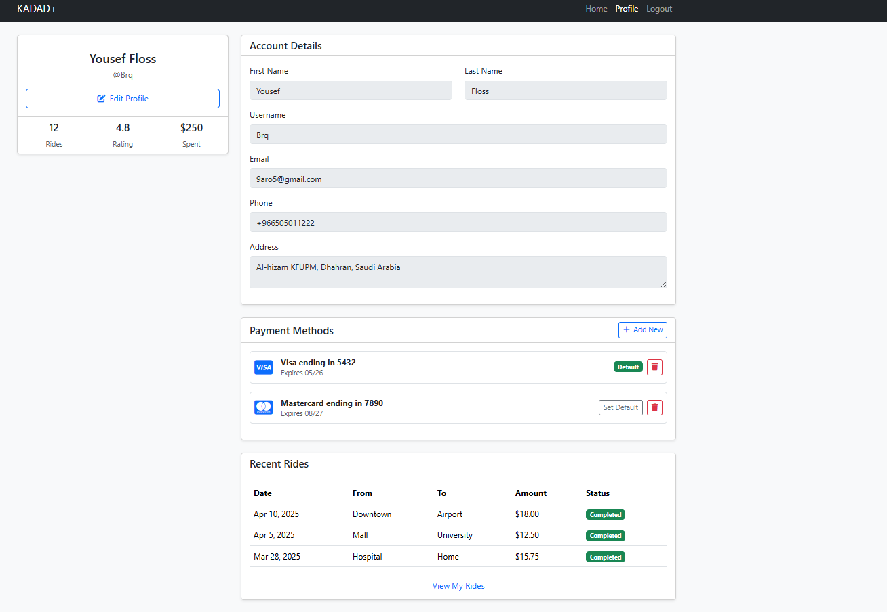
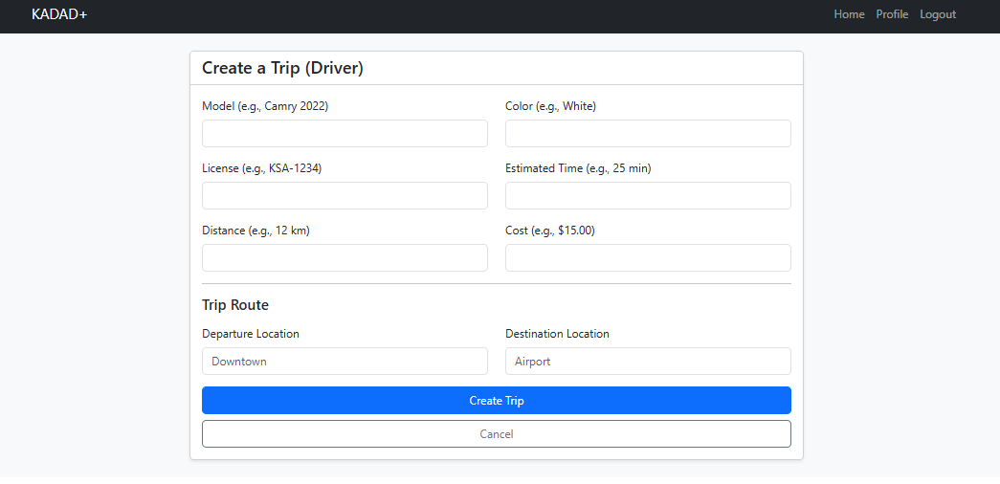

# KADDAD+

A web platform that connects drivers with passengers for intercity and local rides.
KADDAD+ allows students to register either as drivers or passengers. Passengers can browse driver profiles, compare prices, read reviews, and book one-way or round trips. Drivers can specify trip details, passenger limits, and review passengers to build trust. The platform aims to make trip planning safer, smoother, and more transparent for everyone involved.


## 📸 Screenshots


### 🔐 Login Page


The login interface allows users to securely log in using email/password or social media accounts (Google/Facebook).



### 🚗 Available Rides Page


Shows a list of all available rides with details such as origin, destination, travel time, cost, and driver rating.  



### 📍 Ride Details with Map  


Displays a precise map location of the trip along with vehicle details, driver information, and trip summary.  



### 💳 Payment Page  


Users can review the trip summary and securely choose a payment method to complete the booking.  



### ✅ Reservation Confirmation  


Confirms a successful ride booking and shows both trip and driver details, including contact and vehicle info.  



### 👤 User Profile Page  


Displays account information, saved payment methods, and a history of completed rides.  



### 📝 Create Trip (Driver)  


Drivers can use this form to post a new trip by providing vehicle, route, and cost information.  



## 🚀 Features

### 👥 User Roles
<!--
#### Admin
- Manage driver approvals and user reports
- Review ride listings, handle disputes, process refunds
- Send notifications and view platform analytics
-->
#### Student Driver
- Register as a driver and upload documents for approval
- Create, manage, and cancel ride listings
- Accept/reject passenger requests and view earnings dashboard
- Receive payments and rate passengers

#### Student Passenger
- Register and set preferences (e.g., preferred driver gender)
- Search/filter available rides and view driver details
- Book round or one-way trips, pay online, and manage bookings
- Rate drivers and receive ride updates via email

### 🛠 General Functionalities
- User login, registration, and secure authentication
- Password reset and email verification
- Ride cancellation with automated refund handling
- Notification system for ride updates and admin messages
- Driver/passenger review system
<!--
### 📈 Admin Dashboard
- Visual analytics of active rides, earnings, disputes
- Exportable reports
-->


## 🛠️ Tech Stack

**Frontend:**  
- HTML
- CSS
- JavaScript  
- Bootstrap  
- React.js

**Backend (coming soon):**  
- Node.js 
- Express.js

**Database (coming soon):**  
- MongoDB


## 🚀 Getting Started

Follow these steps to run the project locally:

```bash
git clone https://github.com/aalgadhi/KADDAD.git
cd KADDAD
npm install
npm start
```

If you found some problems in running the program, please try this:
```bash
npm install leaflet
npm install @fortawesome/fontawesome-free
npm install react-router-dom
npm run dev        // instead of npm start
```
